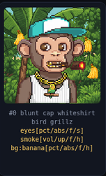
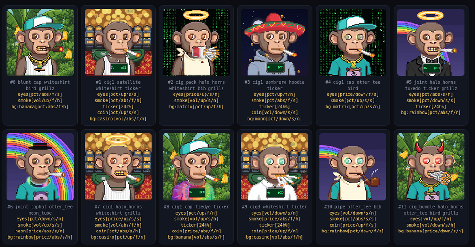
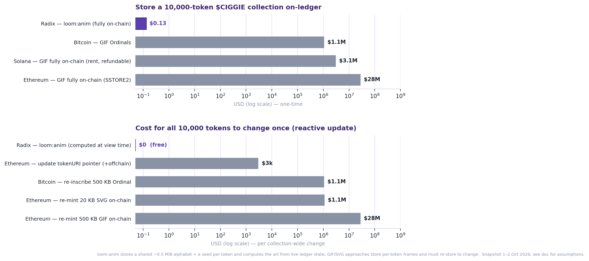

# loom:anim & Ciggie Puffs — White Paper v0.1

*A codec and collection for fully on-chain, ledger-reactive NFTs on Radix.*

**Version 0.1 · 2026-10-03 · Draft**

---

## Abstract

Almost every "on-chain" NFT today stores a pointer — an IPFS CID or an HTTPS URL — to art that lives off-chain. The token is on the ledger; the thing you actually own is not. **loom:anim** is a compact, integer-deterministic animation codec designed so that *every pixel source* fits on a smart-contract ledger, and **Ciggie Puffs** is a 10,000-piece collection built on it where each NFT's art *and* its generated speech are stored on-ledger once and rendered deterministically — and react, in real time, to live market conditions read directly from the ledger. No IPFS, no media server, no oracle. This paper describes the codec, the collection architecture, the on-ledger storage model, the reactive-input system, a cross-chain cost analysis, and a working stokenet deployment of all 10,000 tokens.

*One of 10,000. Every pixel is decoded from a ~0.5 MiB bundle stored once on-ledger; the `eyes[…]`, `smoke[…]`, `bg[…]` bindings below each monkey show which live ledger signal drives each effect — seeded per token.*

---

## 1. Motivation

On-chain NFT art has three recurring failure modes:

1. **Off-chain dependence.** IPFS pins lapse; gateways rate-limit; S3 buckets get deleted. "You own the token" rarely means "you own the art."
2. **Static media.** Even fully on-chain SVG collections are frozen at mint. Nothing about the token responds to the world it lives in.
3. **Oracle trust.** Collections that *do* react usually depend on an off-chain oracle pushing data in — another trusted third party.

loom:anim + Ciggie Puffs target all three: the art and text are **on the ledger**, the renderer is **deterministic** (anyone can reproduce byte-for-byte), and the reactive inputs are **read from the ledger itself** (DEX pool state, network throughput, account holdings) rather than pushed by an oracle.

---

## 2. The loom:anim codec

loom:anim (v0) is a dependency-free codec for small, palette- or true-color animations, optimized for *on-ledger byte cost* and *integer determinism* (no floats in the hot path, so every client renders identical output).

### 2.1 Document format

A loom document is: `"LOOM"` magic (`0x4C4F4F4D`) · 1-byte version · a layer table. Each layer carries a 1-byte flags field encoding its **mode**, a visibility bit, and a **blend mode** (normal / and a small set of Porter-Duff-safe compositing ops), followed by a varint-framed body. A document may contain multiple layers and multiple frames; frame durations are expressed in **ticks** (4 ticks ≈ 1/15 s). The whole document carries a **SHA-256 hash** of its canonical bytes; `renderDocument` recomputes it and exposes `hashOk`, so a decoder can *prove* the bytes it rendered are the bytes that were stored.

Hard limits (v0): layers ≤ 256×256, indexed palettes ≤ 256 entries. These bounds keep per-layer state small and varint offsets tight.

### 2.2 Indexed mode (cell-diff)

The workhorse. Frames are arrays of palette indices (index 0 = transparent). Encoding is **keyframe + per-frame cell-diff**: the surface is tiled into cells; each subsequent frame emits only the cells that changed. Four opcodes are defined — `0` cell-diff, `1` palette-cycle (recolor without touching pixels — the basis of reactive glow/aura), `2` pan, `3` combo (tileset). For chunky pixel art with localized motion (a blinking eye, a drifting smoke ring, a color-cycling aura) this is dramatically smaller than per-frame images, and it is pure integer arithmetic.

### 2.3 Feather mode (true color)

For soft-alpha / smooth-gradient sources (glows, backgrounds), the **feather** layer stores true color with an integer diff-coder (a selectable predictor + color-space transform, optional integer downscale). It is lossless for the content it targets and avoids the palette-banding an indexed layer would show on gradients.

### 2.4 Transport compression

On the wire and on the ledger, loom documents are further compressed with **LZMA-alone** (the `.lzma` container, ~13 % denser than gzip for this data). Browsers have no native LZMA, so the renderer bundles a small (~60-line) hand-written, byte-exact LZMA decoder. Gzip-wrapped assets are also recognized and inflated natively via `DecompressionStream`.

The net result: a complex 256×256 reactive character with dozens of trait layers compresses to a few KB to low tens of KB per layer; the entire Ciggie Puffs art library is **~272 KB** LZMA'd.

---

## 3. Ciggie Puffs — collection architecture

Ciggie Puffs is a collection of smoking-monkey PFPs. The design principle: **store the shared machinery once, store each token as a tiny seed.**

### 3.1 Shared palette + diff-extracted traits

AI-generated source art (a plain base monkey plus each accessory as an *edit-on-base* image) is diff-extracted into transparent, named trait layers (`hoodie`, `grillz`, `crown`, `eyepatch`, …), all indexed to a **single shared ≤254-color palette**. Storing one palette for the whole collection — rather than one per image — is a large saving and is what makes the shared library approach viable.

### 3.2 Per-token seed → recipe

Each NFT is, on-ledger, essentially an integer id. A deterministic engine, `resolve(spec, seed)`, maps that seed to a **recipe**: which traits the monkey has, which backgrounds/FX, and crucially *which ledger input drives each reactive effect, in which direction, with what sensitivity*. Two monkeys with adjacent ids look and behave completely differently; the collection's `10^9+` possible appearances all derive from one spec + one seed each.

*Twelve of the 10,000. Each is a different seed: a base variant (classic / gold / zombie / albino / female), a mandatory cigarette, and a stack of trait layers (hats, chains, grillz, shades, backgrounds). The label under each lists its traits and its reactive bindings — e.g. `eyes[pct/up/f/s]` = eyes driven by price **pct**-change, **up** direction; `smoke[vol/…]` = cigarette smoke driven by **vol**ume; `bg[…]` = reactive background. No two are seeded alike.*

### 3.3 The Talking Loom (deterministic generated speech)

Beyond art, each monkey **talks**. Rather than store a line per token, we store a compact n-gram **language model** (5-/4-/3-/2-/1-gram tables with chain-preserving backoff pruning, plus a large pool of corpus-derived "openings" and reverse-ending tables for clean phrase closure). A deterministic decoder walks the model from a per-token seed to assemble a unique line that also reacts to the live quote (mood gates on price direction). The model is **~625 KB** on-ledger, yields **~18,190** distinct openings, and produces **~96 %** unique lines across the collection — while being a *closed* system: every token it can emit comes from the stored dictionary, which is the key to moderation (§6).

### 3.4 Reactive behaviors

Effects are expressed as bindings over a generic input interface: `drive(fx)` (0..1 intensity) and `senti(fx)` (−1..1 sentiment) read whichever ledger input the recipe assigned, scaled per the spec. Glowing eyes on a pump, dizzy-eyes on a dump, cigarette-smoke volume ∝ network activity, `$CIGGIE` coin-rain, a launchpad rocket that ignites and lifts off past a threshold, a per-account "social mood" blended from the *other* Ciggie Puffs in a wallet — all are the same primitive over different feeds.

---

## 4. On-ledger storage model

### 4.1 The bundle

The complete render payload — the loom art library, the Talking Loom model, and the collection spec — is concatenated into one **~900 KB bundle** with a small slice index (asset → offset, length).

### 4.2 Chunked KVStore, sealed once

A Radix transaction payload is capped at **~1 MiB**, so the bundle is split into a few **~400 KB chunks** and uploaded into the collection component's `KeyValueStore<u32, Vec<u8>>` over a handful of transactions, then **sealed** — after which the bundle is permanently immutable. The on-ledger bytes are byte-identical to what the renderer decodes; a client reassembles chunks `0..n` from the KVStore (read directly via the Gateway, no method call) and slices the bundle by the index.

### 4.3 The component

A Scrypto component (`CiggiePuffs`) owns the bundle KVStore and the NFT resource. Minting is owner-gated and **mints to the owner's own account** (no marketplace, no pay-to-mint, no on-ledger airdrop — distribution is handled off-component). Per-token `NonFungibleData` is deliberately tiny: a fixed **name** ("First Type Last", computed at mint with the exact same hash + pools the renderer uses, so the wallet name always matches the rendered name), a **mutable `key_image_url`** (owner-updatable via a future CMS), and a mint timestamp. The integer NFID *is* the render seed. Collection metadata (name, description, tags, locked; icon/info URLs, mutable) is set on the resource so wallets group and label the collection correctly.

---

## 5. Reactive inputs — read from the ledger, not an oracle

The collection reacts to eleven inputs, all sourced **keylessly from the public Radix Gateway**:

- **Token prices & 24 h change** for XRD, EARLY, OCI, and CIGGIE — read straight from **on-ledger DEX pool state**. Constant-product ("basic") pools give spot price from the reserve ratio; concentrated-liquidity ("precision") pools expose it as `price_sqrt²`. XRD→USD is anchored through an on-ledger XRD/stablecoin pool, so every token is priced in USD with no price API in the loop. 24 h change comes from reading the *same pool at a historical ledger state* (`at_ledger_state.timestamp`) — history, on-ledger, for free.
- **Network throughput** — 24 h transaction volume as the delta of the ledger `state_version` over a day.
- **Account activity / NFT holdings / social mood** — per-account transaction count and the Ciggie Puffs (and their traits) held in a given wallet.

Because the inputs are ledger reads, the reactive layer inherits the ledger's trust model: no oracle, no server, nothing to spoof that the ledger itself doesn't already agree on.

---

## 6. Moderation — a closed, enumerable surface

Mint-once means there is no patching a bad line later, so safety is an **offline** problem. Because the Talking Loom is a *closed* system (every emitted token is in the stored dictionary), the complete set of 3-grams it can ever produce is finite and exported at build time. The audit scans (a) the spoken vocabulary, (b) **every** producible trigram, and (c) a large fuzz sample of decoded lines against a policy lexicon (slurs, sexual, self-harm, violence, financial guarantees — while explicitly allowing crypto swagger). Offending material is removed from the corpus at the source (highest-leverage control) and the model is rebuilt and re-audited until clean. The shipped model audits to **zero** flagged words, trigrams, and lines.

---

## 7. Rendering & verification

The renderer is a small deterministic viewer intended to live alongside the assets. It reassembles the bundle from the ledger, decodes each loom document (`hashOk` proving byte-exact round-trip), runs `resolve(spec, nfid)` per token, and composites the trait layers while driving the reactive FX from the live inputs. Any party can reproduce any token's exact appearance and speech from public data — the ledger bytes plus the open renderer — which is the whole point of "on-chain."

---

## 8. Reference deployment (stokenet)

All of the above is live on Radix **stokenet**, deployed entirely headlessly (a generated key + the Radix Engine Toolkit, no mobile wallet):

- Package, component, and NFT resource published and instantiated.
- The ~900 KB bundle uploaded as 3 chunks and **sealed**.
- **All 10,000 NFTs minted.** On-ledger names verified to match the renderer exactly (e.g. `#0` = "Chunk Menace Marlborough").
- A public, dependency-free **preview page** renders the collection by reading the bundle and per-token data straight from the ledger, with reactive inputs drawn from Radix mainnet market data.

---

## 9. On-ledger economics — why loom:anim *and* Radix both win

The whole design turns on one distinction: **loom:anim stores a function, not frames.** A GIF/SVG NFT stores *pixels* — one (or many) baked image(s) per token, which are *fixed*; to show a different state you must store a different picture. loom:anim stores a deterministic renderer + a shared art "alphabet" + one seed per token, and computes each monkey as `render(f(ledger, seed))` **at view time**. That single difference drives every number below.

*(Snapshot 1–2 Oct 2026. BTC $84,798 · ETH $2,738 · SOL $118 · XRD $0.0024 · AR ~$4.1; ETH at 10 gwei. USD figures are modelled from published cost primitives × our measured byte footprint — treat as order-of-magnitude.)*

The measured footprint of the **entire** collection, on-chain: a **~0.5 MiB shared bundle** (art alphabet + renderer + codec + spec) stored *once* and serving all 10,000 tokens, plus ~4 bytes of seed per token (or **0** when the seed is the NFT id). A comparable GIF collection stores **~500 KB per token** → ~5 GB for 10,000 — roughly **10,000× more data**.

**Table 1 — store the 10,000-token collection on-ledger**

| Chain / method | Art truly on-chain? | Data | USD (one-time) |
|---|---|---|---|
| **Radix — loom:anim** | **Yes** | **0.55 MiB** total | **~$0.13** |
| Ethereum — GIF fully on-chain (SSTORE2) | Yes | ~5 GB | ~**$28 M** |
| Solana — GIF fully on-chain (rent) | Yes | ~5 GB | ~**$3.0 M** locked (refundable) |
| Bitcoin — GIF Ordinals | Yes | ~5 GB (witness) | ~**$1.1 M** (→ ~$5 M @5 sat/vB) |
| Ethereum / Solana — GIF on Arweave + pointer | **No** (media off-chain) | pointer on-chain | ~$50 + mint |

loom-on-Radix stores the whole collection for **~$0.13** because it stores ~0.5 MiB *once* instead of ~5 GB of per-token frames. Truly *fully-on-chain animated* art is otherwise ~$28 M on Ethereum, ~$1–5 M on Bitcoin, ~$3 M of locked capital on Solana. The options that look "cheap" get there by putting the art **off-chain** — which loom does not need to.

**Table 2 — cost per reactive visual change (all 10,000 tokens change once)**

| Method | Cost | Continuous real-time reactivity? |
|---|---|---|
| **Radix — loom:anim** (re-evaluated at view time) | **$0** | **Yes — unlimited, every tick, free** |
| Ethereum — tokenURI pointer swap (+off-chain) | ~$1k–5.5k + 10k uploads + keeper | Partial (off-chain, needs oracle) |
| Bitcoin — re-inscribe 500 KB | ~$1.08 M (and 10k new inscriptions, forever) | No — immutable |
| Ethereum — re-mint 500 KB GIF on-chain | ~$28 M | No |

A picture has no notion of "react": to show a new state you must *store* a new picture (a write) or swap an off-chain pointer (one tx + a keeper, and no longer on-chain art). A collection whose art tracks a live price every second is not expressible that way at any price. loom:anim stores the *function*, so a change costs **nothing** and happens **continuously**.

**Table 3 — porting loom:anim itself (the same 0.55 MiB bundle) to each chain**

| Chain | Store the bundle | Market-reactive at view time? | Verdict |
|---|--:|---|---|
| **Radix** | **~$0.13** | **Native, free, whole-ledger** | **Ideal host** |
| Arweave (paired w/ a chain) | ~$0.01 | only via the paired chain | cheapest storage; not a state layer |
| Bitcoin (recursive inscriptions) | ~$122 | **No** — no contracts/oracles/state | static/time-driven only |
| Solana | ~$346 (refundable) | Partial — Pyth price; activity needs an indexer | possible; no on-chain-render precedent |
| Ethereum | ~$3,160 | Partial — Chainlink price; activity needs an indexer | possible; **~24,000× Radix** storage |

**Why both win.** *loom:anim* wins the **architecture**: storing a function instead of frames is ~10,000× less data and makes per-token, per-tick reactivity cost **$0** — and this property is *portable* to any chain. *Radix* wins the **host**: it is both the cheapest place to store the bundle (**$0.13**, a burned protocol-constant fee of 100 XRD/MiB) **and** the only one where the reactivity is *native and rich*. The Radix **Gateway** returns *any* ledger state over free HTTP/JSON with an `at_ledger_state` snapshot for determinism — so a monkey can react to a DEX pool's price, the holder's own vault balances and 24 h activity, or any NFT field, in one keyless `fetch`, no oracle and no indexer. Ethereum and Solana can do loom:anim but are bounded to oracle feeds (Chainlink/Pyth) for anything richer than a single price unless you bolt on an indexer, and pay 24,000×/2,600× more to store the bundle; Bitcoin can store and even *render* it but cannot read a price or wallet at all, so market-reactivity is simply impossible there. The function model needs a chain whose whole state is cheap to store on and free to read from — **that is Radix.**

---

## 10. Future work

- **Mainnet deployment** with the creator as owner.
- **Renderer-on-chain**: store the gzipped deterministic viewer in the KVStore too, so the entire experience reconstructs from the ledger alone.
- **Richer loom opcodes** (the reserved pan/combo paths) and a conditional-layer mode for heavier reactivity at lower byte cost.
- **dApp Definition + verified metadata**, and a content-management path for the mutable per-token image URLs.
- A formal **loom:anim v1** spec with conformance vectors.

---

## 11. Conclusion

loom:anim shows that "fully on-chain" need not mean "static SVG" or "IPFS with extra steps." With an integer-deterministic codec sized for ledger economics, a shared-library + per-token-seed collection model, a closed and auditable generative text system, and reactive inputs read directly from ledger state, a 10,000-piece animated, *talking*, market-reactive collection fits on-chain and reproduces from public data alone. Ciggie Puffs is the reference implementation.

---

*Status: v0.1 draft. See `docs/loom-anim-v0.md` (codec spec), `docs/stokenet-deployment-checklist.md` (deployment record), and the public preview for the live system.*
